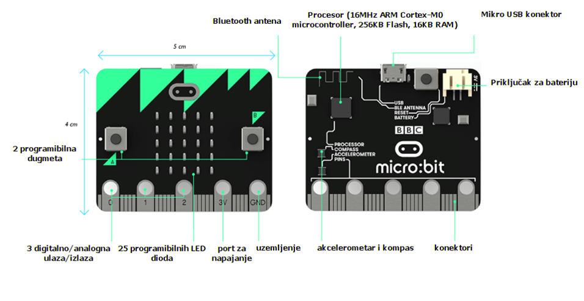
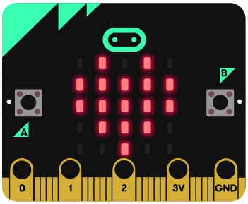

Micro:bit-основни характеристики и компоненти
==============================================

Преди да дадем старт на Micro:bit програмирането чрез MakeCode ще се запознаем с основните компоненти и характеристики на Micro:bit и работната среда.

Micro:bit-основни характеристики и компоненти
::::::::::::::::::::::::::::::::::::::::::::::

Micro:bit е портативен, програмируем от потребителя компютър, който притежава 32-битов ARM Cortex-M0 компресор, работещ на 16MHz със само 16KB RAM памет, асъщо и сензори и екран, направен от 25 LED диода. Налични са конектори, пет входа и изхода  (I/O), използвани да свържат Micro:bit с други устройства или сензори, асъщо и блутут, а самият той е захранен от две АА батерии. 
Най-важното- Micro:bit има способността да програмира.

Micro:bit се състои от следните физически компоненти:

•	25 LED диода, които са индивидуално програмируеми

•	Два бутона, надписани А и В

•	Пинове

•	Температурни и светлинни датчици

•	Сензори за движение (акселерометър и компас)

•	Безжична комуникация чрез радио и Bluetooth

•	USB интерфейс

•	Бутон, възстановяващ първоначалните настройки

**Светодиоди (LED)**

Светодиодът е диод, който свети. Micro:bit има 25 LED-а (аранжирани в мрежа 5х5), индивидуално програмируеми и, в зависимост от програмата, те могат да представят текст, цифри и картинки.

**Бутони А и В**

.. image:: ../_images/_imageMicroBit/66.png
      :align: center

На предната част на Micro:bit устройството има два бутона, означени А и В. Натискането на всеки от бутоните поотделно или и двата едновременно задейства кода на устройството.

**Пинове**

.. image:: ../_images/_imageMicroBit/67.png
      :align: center

Те се използват да свържат Micro:bit с други устройства или сензори.

**Светлинни сензори**

LED-овете се намират на предната част на Micro:bit. В такъв случай, те играят ролята на част от входащото устройство. LED екранът работи като обикновен светлинен сензор, който може да засече наситеността на околната светлина.

**Температурни сензори**

.. image:: ../_images/_imageMicroBit/65.png
      :width: 192px
      :align: center

Те позволяват на Micro:bit да засече околната температура в градуси по Целзий.

**Акселерометър**

.. image:: ../_images/_imageMicroBit/68.png
      :align: center

Акселерометърът е компонентът, който засича движение, промени в скоростта и позиционирането, при възможност за засичане на скоростта на движение. С този компонент Micro:bit отчита кога е бил преместен. Възможно е също да засече и други движения, като клатене, накланяне или свободно падане.

**Компас**

.. image:: ../_images/_imageMicroBit/68.png
      :align: center

Компасът взема предвид земното магнитно поле, което ни позволява да засечем в коя посока е насочен Micro:bit. Компасът трябва да е калибриран преди да може а се използва. Калибрирането осигурява точно определяне на посоката. Когато калибрирането започне, Micro:bit ще покаже инструкцията „Начертай кръг“ или „Наклони да запълниш екрана“. За да калибрирате компаса, ще трябва да следвате инструкцията и да наклоните Micro:bit в кръг, за да преместите точката от центъра на екрана, докато очертанието на кръга не се изпълни с точки.

**Радио и Bluetooth**

.. image:: ../_images/_imageMicroBit/65_.png
      :width: 192px
      :align: center

Радио компонентът задейства безжичната комуникация между два или повече Micro:bit. Радиото може да бъде използвано за изпращане на съобщения до други Micro:bit, създаване на игри с множество играчи, викторини и т.н. Bluetooth Low Energy (BLE) антената позволява на Micro:bit да изпраща и прииема Bluetooth сигнали, например да камуникира безжично с компютри, телефони и таблети.

**USB Интерфейс**

.. image:: ../_images/_imageMicroBit/69.png
      :align: center

USB Интерфейсът ни позволява да свържем Micro:bit с нашия компютър, използвайки микро- USB кабел, който ще захранва устройството и ще ни разреши да сваляме програми на Micro:bit-а.

Работна среда
::::::::::::::

Можем да задействаме своята работна среда чрез своя браузър на  https://makecode.microbit.org web page.

Можем да започнем нов проект, натискайки бутона „New Project“ |newproject|.

Този онлайн  редактор предлага възможността от кодирането в JavaScript или блоково програмиране, където командите са наслагани чрез техниката „drag and drop“. Ние ще разглеждаме блоковото програмиране.

Micro:bit мрежовата среда в MakeCode редакторът има симулатор (1) от лявата страна, който пуска програмата веднага след написването и, следователно, чрез визуализация, потребителят може лесно да установи грешките в програмата. В средата на мрежовата среда има меню (2), където командите са подредени в групи. Отдясно има работно пространство (3), където можете да влачите команди и да конструирате програми.

.. image:: ../_images/_imageMicroBit/2.png
      :align: center

Когато нов проект е започнат, два блока се появяват на работната повърхност на MakeCode: на старт и завинаги. Първият блок  |onstart| е един о от Основната категория и блоковете, поставени в него се изпълняват само при пускането на програмата. Докато блокът |forever| е блок, в който комадите ще се изпълнят безкраен брой пъти. Пускането на този блок никога не спира само. То ще приключи, щом потребителят натисне копчето за спиране на програмата  (|stop|). 
В MakeCode програмите са съставени от разнообразни, но свързани блокове (команди), които са разделени на категории по своята цел.

.. |stop| image:: ../_images/_imageMicroBit/p2.png
.. |onstart| image:: ../_images/_imageMicroBit/s20.png
.. |forever| image:: ../_images/_imageMicroBit/s1.png

.. image:: ../_images/_imageMicroBit/3_.png
      :align: center

Името на категорията (напр. ''Music'' ) посочва на потребителя какъв тип команди/блокове използва в тази специфична категория. Всички блокове, принадлежащи към една категория, са от един цвят. 
Всеки блок е влачен до работния плот и свързан с други блокове по начин, определен от програмата, която се създава.

Натискането на десен бутон върху блок отваря падащо меню, съдържащо опцията, която позволява да съдаваш копия (''Duplicate''), да добавяш коментари (Add Comment), да изтриваш блокове (''Delete Block''), а също и опцията, с която можеш да отвориш информационната секция за допълнително помощ, свързана с определени блокове.

.. image:: ../_images/_imageMicroBit/4_.png
      :align: center

Преди да започнем да създаваме интересни проекти, използвайки Micro:bit устройства, ще се опитаме да се заподнаем с основите на програмиране в MakeCode работната среда.

.. toctree::
   :maxdepth: 2

   Blocks from the Basic Category.rst
   Working with Blocks from the Input Category.rst
   Blocks from the Music Category.rst
   Working with Blocks from the Led Category.rst
   Working with Blocks from the Math and Variables Categories.rst
   Working with Blocks from the Logic Category.rst
   Working with Blocks from the Loops Category.rst
   Working with Blocks from the Radio Category.rst

Проекти
:::::::::

В следващите указания ще представим някои интересни проекти, свързани с Micro:bit  програмирането чрез използването на MakeCode платформата. 
Всички проекти са направени стъпка по стъпка, така че всечке да могат да ги повторят. Всички процедури за конструиране на проекти са разработени от това как устройството е построено до създаването на програмата и тестването и.

.. toctree::
   :maxdepth: 2
   
   Project Task - the Bracelet.rst
   Project Task - the Singing Fruits.rst
   Project Task - the Traffic Light.rst
   Project Task - the House Alarm.rst
   Project Task - the Wire.rst
