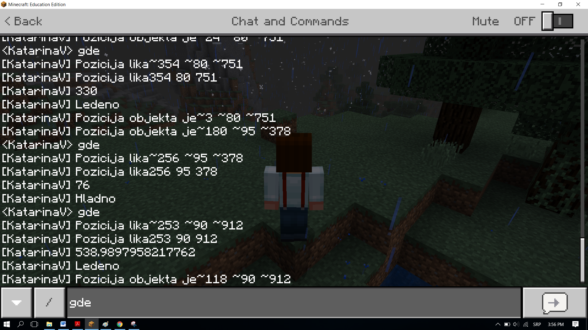
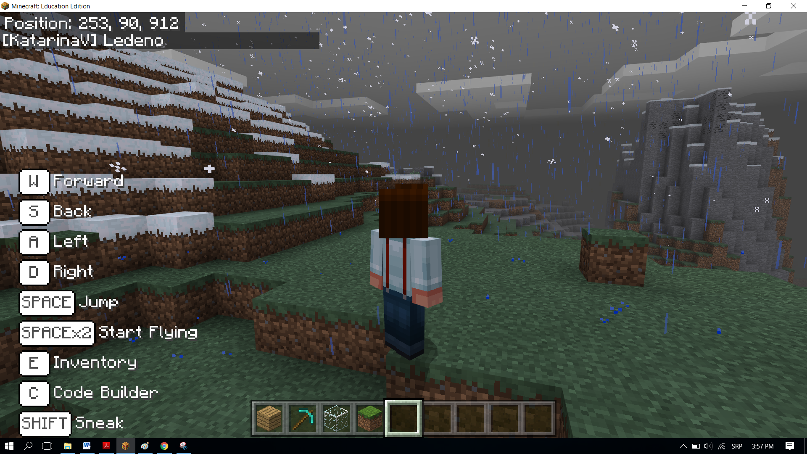

Задача-Топло и студено
==================================

Подобно на вас, и програмите вземят решения. Всички създадени досега програми бяха линейни-командите в тях се изпълняваха последователно, една след друга, до края на програмата. За разлика от тях, в които всяка стъпка, всяка команда, се изпълнява еднократно, в алгоритмите, способни да взимат решение, условните алоритми, някои от командите ще се изпълнят, други-не, което ще зависи от това дали условието се е сбъднало или не.

Ще демонстрираме този принцип, програмирайки играта Топло и студено. Спрямо позицията на героя, ще се появява съобщение колко е далеч от обект някъде в света. Ако героят е близо, думата Топло ще се изпише, но ако е далеч-Студено. Ако е много близо, ще се появи думата Горещо, а ако е много далеч-думата Ледено.

**Етап 1.**

**Нека помислим за решението:** Да определим дестинцията на героя до обект, според която ще получим желаното съобщение.

**Етап 2.**

Отворете ``Code Builder`` (натискайки ``C``); ще се появи прозорец за редактиране, където ще можете да трупате блокове.

В самото начало ще определим обекта и мястото му в света на Minecraft, което ще направим в статовия блок. Нека координатата Х има случайна стойност от 0 до 600, а останалите две координати имат стойности Y и Z. 

За да осъществим това, ще създадем променливите  ``X, Y, Z`` (съхраняват координатите на обекта) и ``Block``  (съхранява обекта). Също така трябва и да нагласим началната стойност за променливите, които създадохме.

В блока |start| ще определим позицията и типа на обекта, влачейки блоковете в следната последователност:

- ще определим координатата х в променливата Х, която ще придобие случайна стойност в интервала от 0 до 600 чрез блока |Math|.

- ще определим координатата y в променливата ``Y``, която ще придобие стойността y, координатите на позицията на играча в света. Това се постига с блока |getY| от категория |Positions|, където ще поставим променливата ``Y`` вместо променловата **позиция**, и блокът |world| от категория |Player|.

- ще определим координатата z в променливата ``Z``, която ще придобие стойността z, координатите на позицията на играча в света. Това се постига с блока |getZ| от категория |Positions|, където ще поставим променливата ``Z`` вместо променливата **позиция**, и блокът |world| от категория |Player|.

- ще определим къде да бъде поставен обекта чрез блока  |blok| от блока |Blocks|.

.. |start| image:: ../_images/_imageMinecraft/28.png
              :width: 150px

.. |random| image:: ../_images/_imageMinecraft/s15.png

.. |Math| image:: ../_images/_imageMinecraft/s16.png
              :width: 100px

.. |getY| image:: ../_images/_imageMinecraft/s17.png

.. |getZ| image:: ../_images/_imageMinecraft/s18.png

.. |Player| image:: ../_images/_imageMinecraft/27_.png
              :width: 100px

.. |Positions| image:: ../_images/_imageMinecraft/0.png
              :width: 100px

.. |Blocks| image:: ../_images/_imageMinecraft/33_.png
              :width: 100px

.. |blok| image:: ../_images/_imageMinecraft/79.png
              :width: 80px

Блокът след определяне на променливите:

.. image:: ../_images/_imageMinecraft/80.png
      :align: center

След като променливите са определени, ще завлечем блока, който физически ще постави обекта някъде в играта. 
Затова използваме блока |place| от категория |Blocks|. Този блок има два аргументни блока, в първия аргументен блок трябва да завлечем променливата |b1|, а във втория да поставим координатите|X|, |Y| и |Z| за да дефинираме позицията на обекта използвайки блока |b2| от категория |Positions|.

.. |place| image:: ../_images/_imageMinecraft/s19.png

.. |b1| image:: ../_images/_imageMinecraft/s20.png

.. |X| image:: ../_images/_imageMinecraft/s21.png

.. |Y| image:: ../_images/_imageMinecraft/s22.png

.. |Z| image:: ../_images/_imageMinecraft/s23.png

.. |b2| image:: ../_images/_imageMinecraft/82.png

Модифицираният код:

.. image:: ../_images/_imageMinecraft/81.png
      :align: center

Така сме определили местоположението на обекта в Minecraft. Ако искаме да видим координатите му, можем да използваме блока |say|. За да покажем тази информация използваме блока |join| от субкатегория |Text| of the category |Advanced|.

.. |say| image:: ../_images/_imageMinecraft/27.png

.. |join| image:: ../_images/_imageMinecraft/s26.png

.. |Text| image:: ../_images/_imageMinecraft/s25.png
            :width: 100px

.. |Advanced| image:: ../_images/_imageMinecraft/s24.png
            :width: 100px

Програмата след добавянето на този блок:

.. image:: ../_images/_imageMinecraft/83.png
      :align: center

Следващата ни стъпка ще бъде да завлечем блоковете,които ще използваме да определим разстоянието между обекта поставен в света и играча, в блока |chat|. Това ще стане като определим променливите, които ще съхранят позицията на героя, т.е. ще съхранят координатите x, y, z на героя. Индивидуалните координати са получени чрез блоковете |world| и |getof|.

.. |chat| image:: ../_images/_imageMinecraft/s27.png
.. |getof| image:: ../_images/_imageMinecraft/s28.png

WeСъздаваме променливите **X1, Y1** и **Z1** и им даваме стойностите на координатите на героя:

.. image:: ../_images/_imageMinecraft/84.png
      :align: center

За да изчислим разстоянието между героя и обекта, ще използваме формулата от математиката за определяне на дистанцията в триизмерни пространства между две точки A (x1, y1, z1) и B(x2, y2, z2):

.. image:: ../_images/_imageMinecraft/s29.png
      :align: center

Създаваме променливата **distance**, даваме и стойността, получена чрез формулата. 

В MakeCode математическите операции се намират в категорията |Math|. Ще конструираме споменатата формула като добавим подходящите блокове  (``+``, ``-``, и умножение на квадрат ``**``, както и корен квадратен):

.. image:: ../_images/_imageMinecraft/85.png
      :align: center

Обновеният код:

.. image:: ../_images/_imageMinecraft/86.png
      :align: center

След като имаме стойността на променливата **distance**, можем да изпълним играта си Топло и Студено.

Според това колко е далече героят от обекта, Minecraft информира потребителя чрез кратки съобщения като Топло, Студено, Горещо и Ледено. Според задачата:

Based on the setup of the task:

-	Ако разстоянието е повече от 100 блока, програмата ще каже Ледено.
-	Ако разстоянието е повече от 50 блока, програмата ще каже Студено.
-	Ако радстоянието е повече от 25 блока, съобщението ще бъде Топло.
-	Ако разстоянието е повече от 12 блока, ще бъде изписано съобщението Горещо.
-	Ако разстоянието до обекта е 0, то съобщението ще бъде Намерено.

Ще използваме блока |ifthen| и сравнителните оператори (> и =) от категорията  |Logic|. Ще добавим разклонения като натиснем знака +. 
Видът на кода след тези блокове:

.. image:: ../_images/_imageMinecraft/88.png
      :align: center

.. |ifthen| image:: ../_images/_imageMinecraft/s32.png
.. |Logic| image:: ../_images/_imageMinecraft/s31.png

Крайната програма за играта Топло и студено:

.. image:: ../_images/_imageMinecraft/89.png
      :align: center

**Етап 3**

Тестване на програмата: 
Натиснете бутона |Play|.

.. |Play| image:: ../_images/_imageMinecraft/15.png
          :width: 40px

Ще започнем чата, натискайки бутона Т на клавиатурата, ще въведем думата where (kъдe), която ще задейства програмата.

