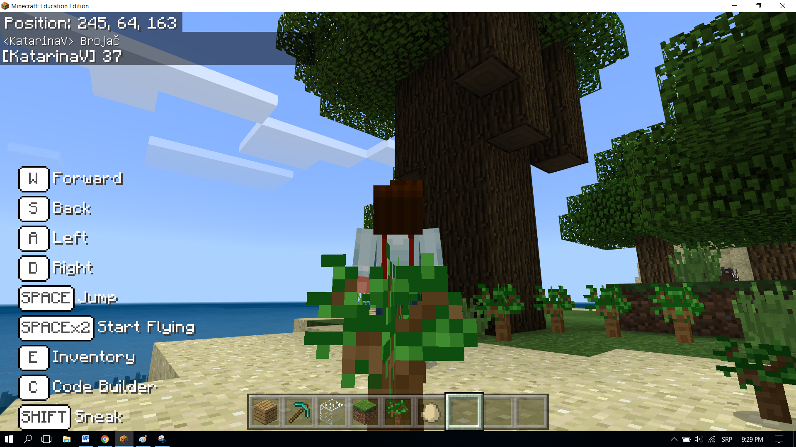

Задача-Колко са дръвчетата?
===========================

Компютърът има нужда то контейнери за съхранение на числа, текст и друга информация, за даможе да взима решения според нея. Например, ако искаме да направим прогноза за времето, ще ни трябват променливи, като температура, време на деня, на седмицата, валежи и т.н. 

Променливата може да бъде разбрана като пространство в компютърната памет, нещо като кутия, в което се запазват някои временни стойности (като броят на засадените дръвчета). 

Всяка стойност съхранява специфичен тип информация. Първият път, когато я използваме, трябва да определим нейния тип (число, връзка, т.е. текст-връзка от алфачислови знаци, логически-true/false). Оттози момент до края на програмата, ще можем да съхраняваме само този специфичен вид информация в тази променлива. 

Променливите имат имена и е достатъчно да използваме имената им, за да употребим стойността им.

**Важно**: Изборът на подходящото име улеснява разбирането на създадените от нас програми. Например, ако искаме да съхраним броя на животите на играча, можем да наречем промеливата брой_животи , което би било по-добро име от „жив“ или „брой“. Имената на променливите съдържат букви, цифри и специални знаци (долна черта _), но винаги трябва да започват с буква.

В предишния пример видяхме, че позицията на предмет (герой, свят) е специален вид променлива, която съдържа три числа, описващи конкретно местоположение в триизмерното пространство. Тези числа са кръстени координати X, Y, Z.

Затова ще използваме пример за програма, която броиброя засадени от играча дръвчета, докато се движи в света, за да демонстрираме и използваме променливите.

**Етап 1.**

**Обмисляне на задачата:** Дърветата се засаждат чрез движение из света. Всеки път, когато дръвче е засадено, брой на дърветата в света нараства.

**Етап 2.**

Отворете ``Code Builder`` (натискайки ``C``); ще се появи прозорец за редактиране, където ще можете да трупате блокове.

За да преброим дърветата, ще обновим програмата от Задачата Засаждане на дървета:

.. image:: ../_images/_imageMinecraft/55.png
          :align: center

Трябва да създадем променливата **Counter**, която ще съхранява броя на засадените дървета.

Променливата се създава от категорията ``Variables`` (1), натискайки бутона ``Make a variable`` (2) и въвеждайки тази променлива в полето (3), в нашия случай това е Counter. Натискайки бутона ОК (4), създаваме променливана (5).

.. image:: ../_images/_imageMinecraft/53.png
          :align: center

Началната стоййност на **брояча** е  0.

Настройването (пренастройването) на началната стойност ще стане чрез блока |start|. Това означава, че всеки път, когато програмата стартира, Minecraft определя началния брой на брояча на 0 и броенето започва от тази стойност.

.. |Loops| image:: ../_images/_imageMinecraft/2_.png
          :width: 100px

.. |Variables| image:: ../_images/_imageMinecraft/3_.png
          :width: 100px

.. |set| image:: ../_images/_imageMinecraft/4_.png

От категория |Loops| изберете блока|start|. Ще използваме този блок като "trigger" за нулирането на променливата **Counter**.

От категория |Variables| завлечете блока |set| и настройте брояча на ``0``:

.. image:: ../_images/_imageMinecraft/54.png
          :align: center

Ще обновим програмата за засаждане на дървета 

.. image:: ../_images/_imageMinecraft/55.png
          :align: center

, добавяйки частта, която ще отчита промяната в променливата **Counter** при засаждане.

Ще използваме стойността на брояча, настроена на 0, но променяща се (увеличаваща се с 1) всеки път, когато героят постави блок, т.е. дърво.

Ще използваме блока  |change| от категория ``Variables``. Ще завлечем този блок в частта от кода, използвана за засаждане на дървета, а също и в блока, в който ще показваме колко дървета са били засадени.

.. |change| image:: ../_images/_imageMinecraft/6_.png

Кодът след промените:

.. image:: ../_images/_imageMinecraft/56.png
          :align: center

Най-накрая, за да видим колко дървета са били посадени, ще представим блока  |chat| , в който ще завлечем блока |say|. В този блок ще вкараме блока |Broj|.

.. |chat| image:: ../_images/_imageMinecraft/8_.png

.. |Broj| image:: ../_images/_imageMinecraft/9_.png

Кодът изглежда така:

.. image:: ../_images/_imageMinecraft/58.png
          :align: center

Кодът на програмата за броене на дървета изглежда така:

.. image:: ../_images/_imageMinecraft/59.png
          :align: center

**Етап 3**

Тестване на програмата: 
Натиснете |Play|.

.. |Play| image:: ../_images/_imageMinecraft/15.png
          :width: 40px

След като тествахме програмата, можем да заключим, че това търсехме като ефект - тя брои колко дървета героят е засадил, движейки се наоколо.