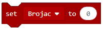
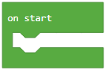
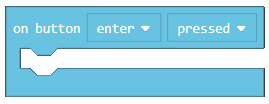
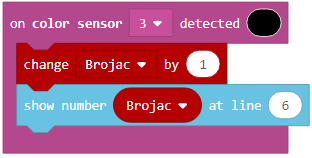

Задача-Средното копче
=================================
Промеливата съхранява стойностите, които могат да бъдат въведени в програмата по-късно.

Променливата може да бъде:

•	Числена

•	Логическа

•	Текстова

Променливата може да бъде разбрана като пространство в компютърната памет, нещо като кутия, в която можем да съхраняваме временни стойности, докато програмата се изпълнява. Когато искаме да използваме стойността на променливата, достатъчно ще бъде само да използваме името и.

Променливата се създава, като от категорията Variables (1) натиснем Make a variable (2) и въведем името на тази променлива в полето (3). Натискайки бутона ОК (4), създаваме променливата.

.. image:: ../_images/_imageEV3/42.png
      :align: center

WЩе демонстрираме употребата на промеливите чрез програма, която показва колко пъти потребителят е натиснал средния бутон на  EV3 Brick-а.

Трябва да създадем променливата |Brojac|. Ще зададем началната стойност на брояча на 0, използвайки блока |setBrojac|. Ще завлечем този блок в  |Start|. В него ще посочим и стойността на брояча в самото начало на екрана на EV3 Brick чрез блока |show|.

.. |Brojac| image:: ../_images/_imageEV3/69.png

.. |show| image:: ../_images/_imageEV3/77.png

Кодът изглежда така:

.. image:: ../_images/_imageEV3/74.png
      :align: center

Задачата изисква програмата да регистрира натискането на копчето от потребителя всеки път, щом това стане. Това ще стане чрез блока:

Задачата изисква програмата да регистрира натискането на копчето от потребителя всеки път, щом това стане. Това ще стане чрез блока |change| от категория |Variable|. Ще използваме блока |show| ,  за да представим новата стойност на променливата в брояча. 

.. |change| image:: ../_images/_imageEV3/79.png
.. |Variable| image:: ../_images/_imageEV3/80.png

Кодът:

.. image:: ../_images/_imageEV3/75.png
      :align: center

Финалния код:

.. image:: ../_images/_imageEV3/76.png
      :align: center

Свържете EV3 Brick-а с компютъра си чрез USB кабел и свалете .uf2 файла на своя компютър, натискайки бутона |dugme1|. Завлечете файла на EV3 и той ще бъде готов за работа.

.. |dugme1| image:: ../_images/_imageEV3/download.png
              :width: 199px

Симулация:

.. image:: ../_images/_imageEV3/78_.png
      :align: center

Можем да илюстрираме една от променливите с друг пример. Можем да създадем програма, която ще брои колко черни линии LEGO роботът е пресякъл.

Нека създадем променливата |Brojac|. Използвайки блока |setBrojac|, ще настроим началната стойност на 0. 
После ще завлечем този блок в |Start|. В него ще посочим и стойността на брояча в началото чрез блока |show|. В дадения блок ще завлечем и |pravo| за да разрешим на робота да се движи продължително.

.. |pravo| image:: ../_images/_imageEV3/6.png

Кодът изглежда така:

.. image:: ../_images/_imageEV3/81_.png
      :align: center

Сензорът трябва да засича черно, което е възможно, благодарение на блока с падащото меню, от което  ще изберем нужния цвят:

.. image:: ../_images/_imageEV3/25.png
      :align: center

Когато сензорът засече черно, ще е нужно стойността на брояча да се увеличи с 1. Това ще стане чрез блока |change| от категория |Variable|. За да представим новата стойност на промеливата Counter (брояч), ще използваме блока |show|.

Кодът изглежда така:

Финалния код изглежда така:

.. image:: ../_images/_imageEV3/81.png
      :align: center

Свържете EV3 Brick-а с компютъра си чрез USB кабел и свалете .uf2 файла на своя компютър, натискайки бутона |dugme1|. Завлечете файла на EV3 и той ще бъде готов за работа.
