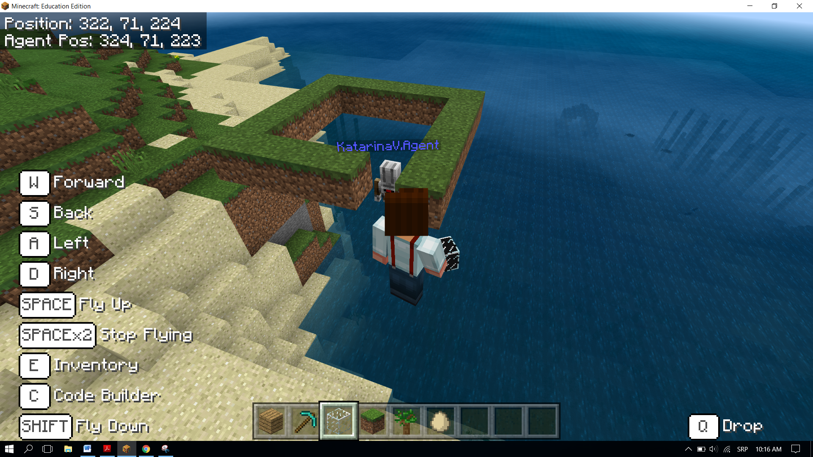
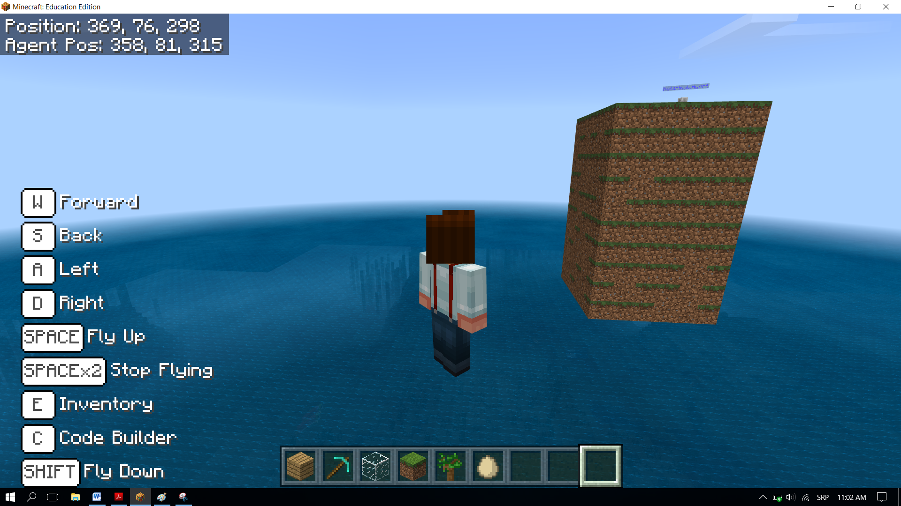

Задача-Колона
=============

Както е в природата (смяната на сезоните, водния кръговрат, ден и нощ, приливите и отливите и т.н.), в програмирането можем да повторим определени стъпки многократно. Нужно е да повторим конкретни части няколко пъти, за да изпълним определени задачи. За тези видове програми казваме, че съдържат повторения, наречени loops (цикли).

Ще демонстрираме повторение като създадем квадратна колона, в основата на която е квадрат с дължина 5 блока, висок 10 блока. 
В Minecraft  можем да използваме **agent** за извършването на определени дейности, като засяване, миньорство, отсичан на дървета и строеж на предмети. Блоковете, свързани с агента се намират в категорията 

.. |Agent| image:: ../_images/_imageMinecraft/s2.png
              :width: 100px

.. image:: ../_images/_imageMinecraft/s5.png
      :align: center

**Етап 1.**

**Задачата:** Движение напред 5 блока и 90-градусов завой наляво и надясно създават квадратна база. Движение по оста z позволява на конструкцията да придобие височина от 10 блока.

**Stage 2**

Отворете ``Code Builder`` (натискайки ``C``); ще се появи прозорец за редактиране, където ще можете да трупате блокове.

Ще разделим задачата на три части:

•	Ще поставим агент на конкретно място в света и ще му дадаем средствата за построяване на обекта

•	Ще създадем основата

•	Ще създадем вертикалната страна на колоната

За да поставим агента, където искаме, ще използваме блока |chat|. Вкарвайки думата **come** , който поставя **agent** на желаното от нас място. Използваме блока |teleport| от категория |Agent| за да го поставим на желаното място. Искаме той да е на две стъпки от героя ни, което ще се осъществи чрез променливата position, която съхранява стойностите на местоположението на героя. 

.. |chat| image:: ../_images/_imageMinecraft/s7.png
.. |teleport| image:: ../_images/_imageMinecraft/s6.png
              :width: 450px

Ще създадем променлива **position** в категорията ``Variables``:

.. image:: ../_images/_imageMinecraft/61.png
      :align: center

Началната стойност на променливата е позицията на героя, преместена два блока наляво. 
Ще определим началната стойност с блока |start|. Това означава, че всеки път, щом програмата започне, Minecraft ще настрои позицията на желаното място (агентът ще бъде на два блока вляво от героя). И ще можем да започнем строежа на основата на колоната.

От категорията ``Variables`` ще завлечем блока |set|, , в който ще въведем блока, даващ ни настоящото местоположение на героя, преместено два блока вляво.  

.. |set| image:: ../_images/_imageMinecraft/s8.png

.. |start| image:: ../_images/_imageMinecraft/28.png
          :width: 150px

.. |Position| image:: ../_images/_imageMinecraft/0.png
            :width: 100px

Това може да стане чрез блока:

.. image:: ../_images/_imageMinecraft/62.png
      :align: center

от категория |Position|.

В горната му част ще завлечем блока |world|, |Player|. В долната ще въведем числото 2 за координатата х.

.. |world| image:: ../_images/_imageMinecraft/28.png

.. |Player| image:: ../_images/_imageMinecraft/42_.png
            :width: 150px

Блокът ``on start``:

.. image:: ../_images/_imageMinecraft/63.png
      :align: center

За да поставим агента на желаното място, ще използвме блока-агент |teleport| от категория |Agent|. Ще поставим променливата  **position** в първия блок за аргументация, а във втория-ще изберем **East/изток (positive X)** от падащото меню.

Кодът:

.. image:: ../_images/_imageMinecraft/65.png
      :align: center

**Етап 3.**

Ще тестваме програмата чрез бутона  |Play|:

.. |Play| image:: ../_images/_imageMinecraft/15.png
          :width: 40px

.. image:: ../_images/_imageMinecraft/64.png
          :align: center

За да може агентът да изгражда блокове, трябва да подсигурим всичко необходимо за строежа да е налично в инвентара. Ще използваме блока |setagent| от категория |Agent|:

.. |setagent| image:: ../_images/_imageMinecraft/s14.png
          :width: 350px

.. image:: ../_images/_imageMinecraft/70.png
          :align: center

**Важно:** инвентарът, който се отваря чрез бутона Е, се използва от играча, за да управлява наличните му предмети. Той се състои от 1 до 9 слота, в които може да съхранява нужните му предмети. 
Трябва да създадем квадратната основа на колоната. Затова ни трябва нещо, което да задейства строежа. Ще използваме чата и текстовия квадрат.

За да посторим основата с дължина 5х5 блока, ще използваме |repeat| от категория |Loops|.

.. |repeat| image:: ../_images/_imageMinecraft/s10.png
.. |Loops| image:: ../_images/_imageMinecraft/2_.png
          :width: 100px

Квадратът е геометрична фигура, направена от четири стени с еднаква дължина, с противоположни паралелни страни и ъгли, равни на 90 градуса. Квадратът има четири страни, така че ще въведем числото 4 в блока за повторение:

.. image:: ../_images/_imageMinecraft/66.png
          :align: center

За да разрешим агента да поставя блокове чрез движение, ще използваме блока  |placeagent| от категория |Agent|.

За да бъде възможно изпълнението на действието, ще трябва да настроим втория блок за аргументи на ``true``:

.. |placeagent| image:: ../_images/_imageMinecraft/s11.png

.. image:: ../_images/_imageMinecraft/67.png
          :align: center

Дължината на страната, която е 5 блока, ще определим с блока  |move| от категория |Agent|:

.. |move| image:: ../_images/_imageMinecraft/s12.png

.. image:: ../_images/_imageMinecraft/68.png
          :align: center

Ъглите на квадрата са 90 градуса, това ще постигнем чрез |turn| от категория  |Agent|:

.. |turn| image:: ../_images/_imageMinecraft/s13.png

.. image:: ../_images/_imageMinecraft/69.png
          :align: center

Ще тестваме програмата чрез бутона |Play|.

След тестването можем да видим, че агентът не е конструирал целия квадрат.

Трябва да преместим агента с блока |move| и изберем опция ``up`` от падащото меню. Ще преместим агента с един блок, поради което още въведем числото 1 като стойност на третия параметър:

.. image:: ../_images/_imageMinecraft/73.png
          :align: center

Сега отново ще тестваме програмата и ще получим квадрат:

.. image:: ../_images/_imageMinecraft/72.png
          :align: center

Според горния код агентът не е в позицията един блок над началната позиция. За да го поставим на желаното място, ще въведем блоковете |turn| и |move|:

.. image:: ../_images/_imageMinecraft/74.png
          :align: center

Докато тестваме програмата, можем да видим, че агента оставя блока след като движението е завършено. Не искаме това да става-ще въведем два блока, които ще поставят агента без блока в позицията за построяването на стената:

.. image:: ../_images/_imageMinecraft/75.png
          :align: center

Остава да съдадем програма за построяването на колоната с височина 10 блока. 

Ще въведем нов loop, където ще въведем вече готовия loop (който създава квадрата). Ще използваме блока |repeat| и ще променим стойността на брояча на 10.  ``10``:

Поставянето на един loop в друг се нарича **nesting/внедряване**.

.. image:: ../_images/_imageMinecraft/77.png
          :align: center

Крайният вид на кода, който ще разреши конструирането на колоната, висока 10 блока, с основа 5х5:

.. image:: ../_images/_imageMinecraft/78.png
          :align: center

**Етап 3**

Тестване: 
Натиснете бутона |Play|.

Така създадохме колона с основа 5х5 и висока 10 блока.
