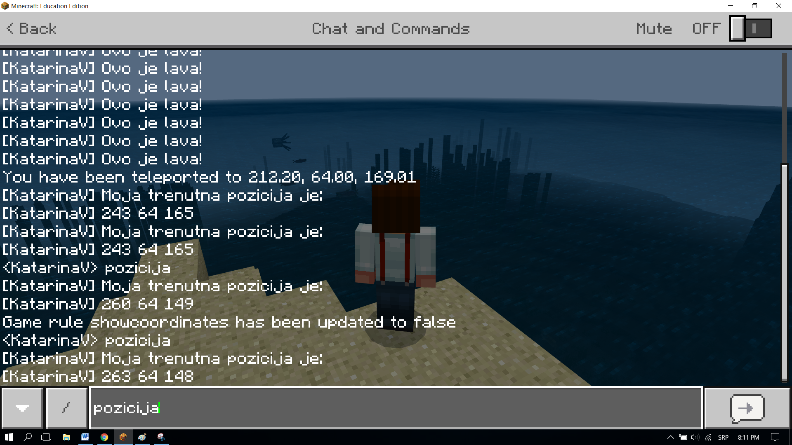
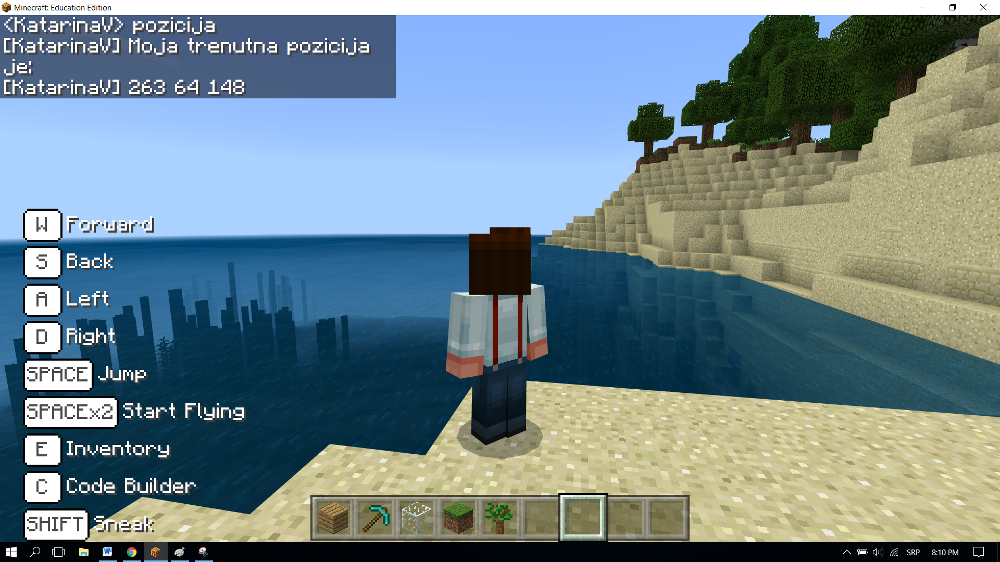
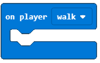
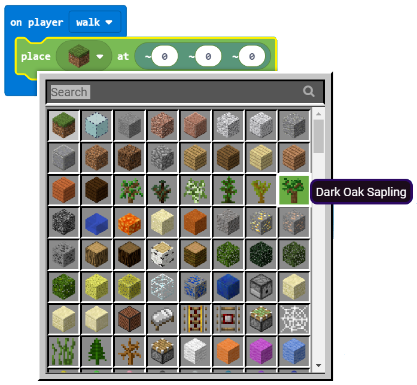
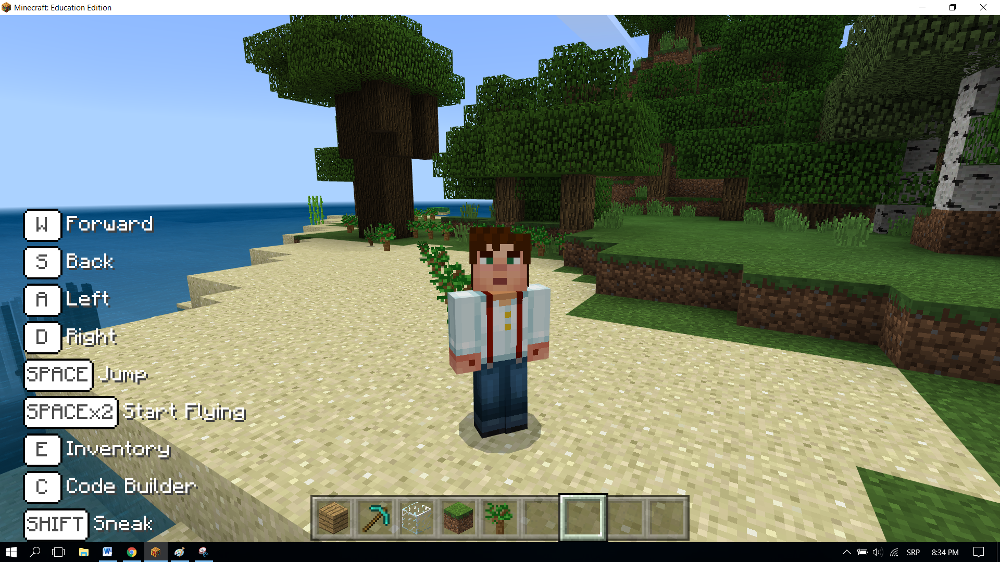

Задача-Засаждане на дървета
===================================

Събитията са случки, които са резултат от действието на потребителя (натискане на мишката, на бутоните на клавиатурата, влачене и пускане и т.н.). Събитието е причина за реакция. 
В компютърната наука действие бива засечено (изпълнано) от компютър. Например, натискайки мишката, отваряме приложение, в което при дъжда хората отварят чадърите си. В програмата частта, която се справя със събитието, се активира чрез осъществяването на самото събитие. В MakeCode тези части са блокове, които обикновено започват с думата **on**:

.. image:: ../_images/_imageMinecraft/31.png
      :align: center

Ще използваме събитие, за да стимулираме засаждане на дръвчета и ще поясним позицията на героя в света на Minecraft, добавяйки командата **position**. 

**Етап 1.**

**Да помислим за задачата:** Героят си взаимодейства със света, движейки се наоколо, например, засаждайки дръвчета. Изпрщането на съобщение (през чата) показва позицията на героя.

**Етап 2.**

Отворете ``Code Builder`` (натискайки ``C``); ще се появи прозорец за редактиране, където ще можете да трупате блокове.

За да започнете чата, да задействате събитие, което ще посочи позицията на героя, трябва да завлечете блока |onchat| от категория |Basic| на работния плот и да въведете думата **position** в полето за въведение на този блок.

.. |onchat| image:: ../_images/_imageMinecraft/40.png
              :width: 250px

.. |Basic| image:: ../_images/_imageMinecraft/40_.png

В този блок трябва да добавим блокове, които ще покажат сегашната ни позиция. За да се покаже, каквото и да е съобщение (т.е.. Моята сегашна позиция е:) трябва да използваме блока |say| от категория |Player|.

Позицията на героя се запаза в блока |position| от категория |Player|. След като решим да посочим позицията на героя в чата, ще използваме блока |string| от категория |Pozicija|. Вместо опция ``position``, ще използваме блока |position| в полето:

.. |say| image:: ../_images/_imageMinecraft/27.png
.. |Player| image:: ../_images/_imageMinecraft/27_.png
.. |position| image:: ../_images/_imageMinecraft/42_.png

.. |Pozicija| image:: ../_images/_imageMinecraft/0.png

.. image:: ../_images/_imageMinecraft/41.png
      :align: center
      :width: 350px

Нека тестваме тази част от кода чрез копчето |Play|.

След като тествами програмата, можем да видим, че нашето намерение се изпълни-щом потребителят натисне копчето Т, отвори чата и въведе съобщението position, позицията на играча в света ще се покаже.

.. |Play| image:: ../_images/_imageMinecraft/15.png
          :width: 40px

Сега ще създадем събитие за героя, което ще му позволи да засади дръвчета в Minecraft чрез неговото движение. Това ще стане чрез блока |walk|. От падащото му меню ще изберем опцията ``walk``:

.. image:: ../_images/_imageMinecraft/44.png
          :align: center

Последно, ще поставим блока |place| от категория |Blocks| в същия този блок. Ще го използваме за поставим (засадим) дръвче. От падащото меню на блока ще иберем блока, представляващ дърво: 

.. |place| image:: ../_images/_imageMinecraft/45.png
              :width: 350px

.. |Blocks| image:: ../_images/_imageMinecraft/33_.png

В частта на блока, където трябва да определим позицията на блока, който искаме да поставим в света ни, ще оставим и трите стойности на 0 |nula|. Това ще позволина дръвчетата да бъдат засадени на същото място, където се намира героят. 

След всички промени, частта от кода за засаждане на дръвчета е представена във фигурата отдолу:

.. |nula| image:: ../_images/_imageMinecraft/47.png

.. image:: ../_images/_imageMinecraft/49.png
          :align: center

**Етап 3.**

Тестване на програмата: 
Натиснете копчето  |Play|.

Щом сме тествали програмата, можем да заключим, че тя отговаря на нашите представи-героят засажда дървета, движейки се наоколо.
