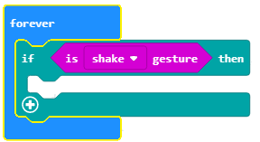

===============
Задача-Алармата
===============

Алармите са устройства, които комуникират с централна контролна единица чрез електронна система и изпращат сигнали за възможните движения и промени, засечени от сензорите.

Типична домашна алармена система съдържа следните компоненти:

-	Конролен панел-централната контролна единица на алармената система
-	Сензори на вратите, прозорците или други мебели
-	Вътрешни/външни сензори за движение
-	Много силна сирена

Принципът е много прост: алармената система охранява пространства, през които може да се влезне в къщата, апартамента, офиса, чрез своите сензори, комуникиращи с централното табло. Сензорите обикновено се намират на врати, прозорци или двуги отвори.

Домашната аларма трябва да засича движение, температура или светлинен интензитет в дадена стая. Ако вратата се отвори, температурата или интензитета се повишат, устройството ще издаде звук. 

За направата на подобна аларма ще ни трябват:

-	3 Micro:bit-а
-	Тиксо
-	Тонколони или слушалки
-	Крокодилски щипки

За създаването на домашната аларма, първо ще трябва да направим физическото устройство, състоящо се от Micro:bit, който ще служи като сензор за движение, друг Micro:bit, който ще засича температурните и светлинните промени, и трети Micro:bit, който ще издава звук при установени промени (този Micro:bit трябва да се намира на 10 м от сензора).

След като сме направили устройството, е ред на програмите за всеки отделен Micro:bit.

Ще програмираме всеки Micro:bit поотделно:

­1. Първо ще програмираме Micro:bit-а, който ще служи като датчик за движение.
2. Вторият ще засича промени в температурата и светлината.
3. Третият произвежда звук ако първите два са задействани.

**Стъпка 1**

Отидете на https://makecode.microbit.org/.

Първо ще програмираме Micro:bit-а, който ще служи като датчик за движение.

**Step 2**

Създавайте нов проект.

Искаме устройството да засича движение, но и да комуникира с останалите Micro:bit-ове, поради което те трябва да принадлежат към една и съща ID група.

**Стъпка 3**

За да създадем ID група, трябва да влачим блока |radioset| от категория |Radio| в блока |onstart| от категория |Basic|. В полето |ID| ще въведем желаното число за ID групата. Това може да е всяко число. Ние ще оставим числото 1. Така ще сме създали група с ID 1, в която всички Micro:bit-а ще общуват.

.. |Radio| image:: ../_images/_imageMicroBit/s21.png
.. |radioset| image:: ../_images/_imageMicroBit/s22.png
.. |Basic| image:: ../_images/_imageMicroBit/s2.png
.. |ID| image:: ../_images/_imageMicroBit/s23.png
.. |onstart| image:: ../_images/_imageMicroBit/onstart.png

Частта от кода, която създава групата за комуникация:

.. image:: ../_images/_imageMicroBit/s24.png
      :align: center

**Стъпка 4**

Завлечете блока |if..then| от категория |Logic| в блока |forever|, намиращ се в категория |Basic|.

.. |forever| image:: ../_images/_imageMicroBit/s1.png
.. |if..then| image:: ../_images/_imageMicroBit/s3.png
.. |Logic| image:: ../_images/_imageMicroBit/s4.png

В условното поле  |uslov| завлечете блока |uslov1| (от категорията  |Input|).

.. |uslov| image:: ../_images/_imageMicroBit/s5.png
.. |Input| image:: ../_images/_imageMicroBit/s6.png
.. |uslov1| image:: ../_images/_imageMicroBit/s7.png

От падащото меню на блока |uslov1|:

.. image:: ../_images/_imageMicroBit/s8.png
      :align: center

Изберете опцията |shake|. Чрез нея устройството ще засича движение.

.. |shake| image:: ../_images/_imageMicroBit/s9.png

Според задачата, когато движение бъде регистрирано (изпълнение на условие), Micro:bit –ът ще изпрати конкретна стойност чрез блока  |radiosend|.

Ще въведем числото 5 в полето |broj| (може да бъде въведена всяка стойност). За да реагира сензорът, т.е. да засече движение, трябва да го настроим на определен период от време-нека бъде 3 секунди (3 000 милисекунди). За тази цел ще използваме блока |time| от категория |Basic|. Във |vreme| ще поставим 3000ms, което ще бъде времето за реакция на сензора, с оглед на появилата се промяна.

.. |broj| image:: ../_images/_imageMicroBit/s32.png
.. |vreme| image:: ../_images/_imageMicroBit/s40.png
.. |time| image:: ../_images/_imageMicroBit/s39.png
.. |radiosend| image:: ../_images/_imageMicroBit/s30.png

.. image:: ../_images/_imageMicroBit/s48.png
      :align: center

**Стъпка 5**

Свалете .hex файла на своя компютър, натискайки бутона  |dugme1| или |dugme2|. Micro:bit-ът ще бъде готов да започне своята работа, когато завлечете файла в него.

.. |dugme1| image:: ../_images/_imageMicroBit/s49.png
.. |dugme2| image:: ../_images/_imageMicroBit/29.png
      :width: 199px

**Стъпка 6**

Сега ще програмираме втория Micro:bit да засича разликата в температурата и светлинния интензитет, а също и да изпраща тази информация на Micro:bit-а, който ще реагира чрез звук. Micro:bit. 
За да комуникират Micro:bit-овете, те трябва да са от една и съща ID група. 

Вече създадохме такава, именувана с числото 1, в която всички Micro:bit-ове ще комуникират:

.. image:: ../_images/_imageMicroBit/s24.png
      :align: center

Завлечете блока |if..then| от категория |Logic| в блока |forever|. Също така ни трябват блоковете, които определят условията в условното поле |uslov|. Едно от условията ще е температурата да е по-висока от 30 градуса, а светлинното ниво да е по-високо от 150.

Условията могат да бъдат сложни (създадени чрез прости условия). 

В нашия случай, простите условия са температурното и светлинното ограничение, които поставихме. 

.. |poredjenje| image:: ../_images/_imageMicroBit/s53.png

Определяме простите си условия с блока |poredjenje|.

В нашия случай :

- температура |temperatura| по-висока от 30: |vece30|.

- светлинен интензитет |intenzitet| по-висок от 150: |vece150|.

.. |temperatura| image:: ../_images/_imageMicroBit/s55.png
.. |intenzitet| image:: ../_images/_imageMicroBit/s54.png
.. |vece30| image:: ../_images/_imageMicroBit/s56.png
.. |vece150| image:: ../_images/_imageMicroBit/s57.png

Използваме логически оператори (boolean) за връзка межди прости условия (AND, OR, NOT).

В MakeCode логически оператори са представени по следния начин:

|and| - свързва две условия и връща отговор True като резултат само ако и двете условия са верни.

|or| - свързва две условия и връща като отговор True ако дори едно от условията е вярно.

|not| - поставя се пред условие и отговаря с True ако условието не е изпълнено.

.. |and| image:: ../_images/_imageMicroBit/s50.png
.. |or| image:: ../_images/_imageMicroBit/s51.png
.. |not| image:: ../_images/_imageMicroBit/s52.png

Условието, което проверява дали има промяна в температурата или светлинния интензитет, се определя от този блок:

.. image:: ../_images/_imageMicroBit/s58.png
      :align: center

Условния блок изглежда така:

.. image:: ../_images/_imageMicroBit/s60.png
      :align: center

Според задачата, щом има промяна в температурата/светлината, Micro:bit-ът ще изпрати определена стойност, използвайки блока |radiosend|. Ще въведем числото 10 в полето |broj| (всяко число може да бъде въведено). За да реагира сензорът, т.е. да отчете промени, трябва да го настроим на определено време-3 сек. (3 000 милисек.). за тази цел ще използваме блока |time| от категория |Basic|. В полето за въведение |vreme| ще въведем 3 000 милисек., което ще бъде времето за реакция на сензора, с оглед на появилата се промяна.

Програмата, засичаща промяна в светлината/температурата: 

.. image:: ../_images/_imageMicroBit/s59.png
      :align: center

**Стъпка 7**

Свалете .hex файла на своя компютър, натискайки бутона |dugme1| или |dugme2|. Micro:bit-ът ще бъде готов да започне своята работа, когато завлечете файла в него.

.. |dugme11| image:: ../_images/_imageMicroBit/s61.png
.. |dugme21| image:: ../_images/_imageMicroBit/29.png
      :width: 199px

**Стъпка 8**

Най-накрая, трябва да програмираме третия Micro:bit. Той ще издава силен звук при получаване на конкретна информация от другите два Micro:bit-а.

Ще създадем ID група 1: 

.. image:: ../_images/_imageMicroBit/s24.png
      :align: center

Следващата стъпка е този Micro:bit да получава информация (число), според която ще отреагира чрез звук. Това ще стане като завлечем от категорията |Radio|:

.. image:: ../_images/_imageMicroBit/s30.png
      :align: center

В него ще завлечем блока |if..then|. В условното поле |uslov| ще завлечем условието, което ще проверява числата (5, 10), получен от другите два Micro:bit-а.

използвайки знака |plus|, ще въведем повече от едно условие. В разклонението с условието |uslov5| и в разклонението с условието |uslov10|, wще завлечем блока |melodija| от чиито падащо меню ще изберем мелодията ``ringtone``) от категорията |Music|, която се използва за въпроизвеждане на звук. 
В допълнение към този блок, ще създадем времеви интервал от една секунда.

.. |plus| image:: ../_images/_imageMicroBit/s15.png
.. |uslov5| image:: ../_images/_imageMicroBit/s63.png
.. |uslov10| image:: ../_images/_imageMicroBit/s64.png
.. |melodija| image:: ../_images/_imageMicroBit/s65.png
.. |Music| image:: ../_images/_imageMicroBit/s66.png

Крайният вид на този блок:

**Забележка**: за възпроизводство на звука е нужно Micro:bit да бъде свързан с тонколоните/слушалките, както следва:

.. image:: ../_images/_imageMicroBit/34.png
      :align: center

** Стъпка 9**

Свалете .hex файла на своя компютър, натискайки бутона |dugme1| или |dugme2|. Micro:bit-ът ще бъде готов да започне своята работа, когато завлечете файла в него.

.. |dugme01| image:: ../_images/_imageMicroBit/s62.png
.. |dugme02| image:: ../_images/_imageMicroBit/29.png
      :width: 199px
