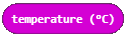
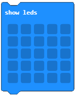

Работа с блокове от категория Input
===================================

Компютърът обработва данните, въведени от потребителя (напр. Натискане на копче...), или от средата чрез сензорите. В MakeCode има категория от блокове, които дават възможност за работа с въведени данни, по-точно с категория блокове, която позволява на програма да изпълни определени действия, основани на информацията, получена от потребителя или средата.

Категорията |input| съдържа блокове (команди), които обработват данни, получени от потребители чрез натискане на бутони или от средата, обработвайки информацията от сензорите.

.. image:: ../_images/_imageMicroBit/p8.png
      :align: center

Въведените данни могат да бъдат получени чрез натискане на копче ``A``, ``B`` или ``A+B``, , а също и четейки стойностите на сензорите за светлина, топлина и акселометърът.

.. |input| image:: ../_images/_imageMicroBit/s26.png

Искаме да създадем програма, която представя температурата в градуси по Целзий, когато бутонът ``A`` е натиснат.

.. |onstart| image:: ../_images/_imageMicroBit/s20.png

.. |forever| image:: ../_images/_imageMicroBit/s1.png

.. mchoice:: L2Z1
    :answer_a: веднъж.
    :answer_b: безброй многоо пъти.
    :feedback_a: Браво!
    :feedback_b: Блокът forever e блок, в рамките, на който командите ще се изпълняват безкрайно много пъти. Изпълнението на този блок никога няма да спре самостоятелно. За да спрете работата на този блок, трябва да натиснете бутона за спиране (|stop|).
    :correct: a

    Колко пъти ще се изпълнят блоковете в |onstart| ?

Както вече видяхме в примерите от предишния урок, как програмата стартира и функционира зависи от използвания блок  |onstart| или |forever|.

За да задействаме входящите данни, да използваме бутон ``А``, за да стартираме програмата, ще трябва да натиснем  |onbutton| от категория|input| , и от падащото му меню да изберем бутон А.

.. |onbutton| image:: ../_images/_imageMicroBit/p9.png

Блокът |onbutton| задейства програмата и всички включени в нея блокове са изпълнени.

Влачим блока ``on button...pressed`` на работния плот и когато вмъкнем в него блока, който ще ни позволи да представим стойностите на температура.

За представяне на температура ще използваме блока |shownumber| от категория |Basic|.

.. |Basic| image:: ../_images/_imageMicroBit/s2.png

След свързванетон атези два блока ще изберем |temperatura| от категория Input, която ще завлачим в полето за въвеждане на командата за показване на числото. Блокът |temperatura| съхранява стойностите, получни от четене на топлинния сензор, който е представен в градуси по Целзий.

Крайната визия на програмата:

.. image:: ../_images/_imageMicroBit/p10.png
      :align: center

Ще използваме симулатора, за да тества програмата. Програмата ще започне след натискането на бутон |play| .

.. |play| image:: ../_images/_imageMicroBit/p3.png

.. mchoice:: L2Z2
    :answer_a: Когато бутонът А е натиснат, стойностите на светлинното ниво ще бъдат представени..
    :answer_b: Когато бутонът В е натиснат, стойностите на светлинното ниво ще бъдат представени.
    :answer_c: Когато бутоните А и В са натиснати, стойностите на светлинното ниво ще бъдат представени.
    :feedback_a: Браво!
    :feedback_b: Отговорът не е верен!
    :feedback_c: Отговорът не е верен!
    :correct: a

    Какво ще задейства представянето на светлинното ниво:

    .. image:: ../_images/_imageMicroBit/p11.png
          :align: center

    Малко помощ: Блокът  |level| запазва стойностите, получени от светлинния ензор, който се намира на дисплея (LED-овете играят ролята на светлинен сензор).

.. |level| image:: ../_images/_imageMicroBit/s54.png

.. mchoice:: L2Z3
    :answer_a: Блок A.
    :answer_b: Блок B.
    :answer_c: Блок C.
    :answer_d: Блок D.
    :feedback_a: Грешен отговор!
    :feedback_b: Грешен отговор!
    :feedback_c: Браво!
    :feedback_d: Грешен отговор!
    :correct: c

    Погледнете внимателно блоковете. Кой представя програма, която ще покаже цвете при движение?

    .. image:: ../_images/_imageMicroBit/p16.png
          :align: center

.. mchoice:: L2Z4
    :answer_a: Когато бутонът А е натиснат, посоката ще се представи.
    :answer_b: Когато бутонът В е натиснат, посоката ще се представи.
    :answer_c: Когато бутоните А и Б са натиснати едновременно, посоката ще се представи.
    :feedback_a: Грешен отговор!
    :feedback_b: Грешен отговор!
    :feedback_c: Браво!
    :correct: c

    Погледни внимателно блока. Какво ще задейства представянето на посоката, в която е поставено устройството?

    .. image:: ../_images/_imageMicroBit/p17.png
          :align: center

**Задача:** Създайте програмата, която ще представи усмихнато личице (използвайки |showleds|) когато бутонът А е натиснат, когато Б е натиснат-да показва имената ви, а при натискане и на двата едновременно-на каква възраст сте.

Сравнете решението си с нашето: https://makecode.microbit.org/_86uV0j7mt0hU

